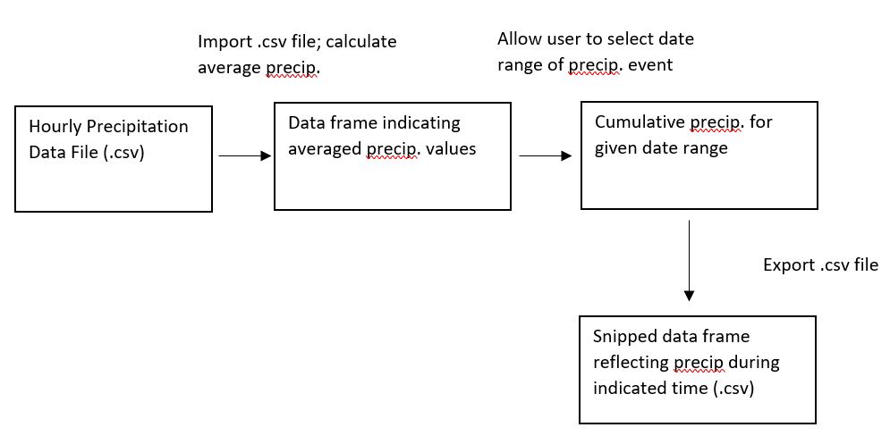

# Cumulative Precipitation from Surface Runoff Events 
**Name:** Elliott Carver  
**Semester:** Spring 2019  
**Project Area:** Agronomy  

#### <u>Background
Phosphorus (P) loss from agricultural production is a significant contributor to surface water contamination. Excessive inputs of P to surface waters can lead to eutrophication, potentially causing an increase in algal and aquatic plant growth (Correll, 1998; Carpenter et al., 1998). Eutrophication, and associated harmful algal blooms, are conservatively estimated to cost the United States’ economy 2.4-4.6 billion dollars a year and it has been estimated that up to 70% of all P that reaches surface waters is linked to a nonpoint agricultural source (Havlin et al., 2005; Dodds et al., 2009). The linkage between nonpoint agricultural P pollution and the degradation of surface water quality has created a need for new agricultural best management practices (BMP) to reduce P loss. To do this, a multiyear, large-scale, trial was run to examine the impacts of cover-crops and phosphorus fertilizer placement on P loss in surface runoff from natural precipitation events. 

#### <u>Objective
As part of this research project, one-minute interval precipitation data was recorded from four rain gauges located across the research site. Additional rainfall data was also recorded at one-minute intervals from the Ashland Bottoms, Kansas, Mesonet station (located approximately 0.5 miles away) Over the course of this project (5 years), this has generated a massive amount of data. This project aims to develop a program which enables the user to enter at start and end time of a precipitation event and be given the total rainfall for the given precipitation period. Total rainfall will be calculated based on the summation of the average precipitation total for the research site. Optimally, precipitation totals would be calculated exclusively from the rain guages located at the research site; however, electronic rain gauges may fail. In this case, this program will replace the missing precipitation data with data from the Mesonet. If no research sites are missing, then the Mesonet data will not be used in the calculation.
    
**NOTE:** The data file used for this code contains daily and not per minute precipitation values. One-minute interval values for the Mesonet station were not available at the time this code was written.  
    

#### <u>Outcomes
This project will calculate the average total rainfall for a given timeframe pluse create a .csv file which contains daily precipitation data for the given precipitation event. 

#### <u>Workflow

#### <u>References

Carpenter, S.R., N.F. Caraco, D.L. Correll, R.W. Howarth, A.N. Sharpley and V.H. Smith.  1998. Nonpoint pollution of surface waters with phosphorus and nitrogen. Ecological Applications. 8:559-568.
    
Correll, D. 1998. The role of phosphorus in the eutrophication of receiving waters: A review. J. Environ. Qual. 27:261-266.
    
Dodds, W.K., J.L. Eitzmann, T.J. Pilger, K.L. Pitts, A.J. Riley, J.T. Schloesser and D.J. Thornburgh. 2009. Eutrophication of U.S. freshwaters: Analysis of potential economic damages. Environ. Sci. Technol. 43:12-19.
    
Havlin, J.L., J.D. Beaton, S.L. Tisdale and W.L. Nelson. 2005. Soil fertility and fertilizers: An introduction to nutrient management. Pearson Education, Upper Saddle River, New Jersey.